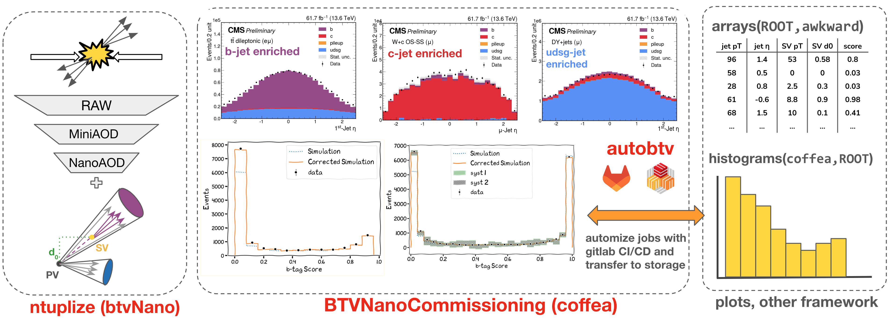

BTVNanoCommissioning
====================

This page documents the setup of the [BTV Run 3 commissioning framework](https://github.com/cms-btv-pog/BTVNanoCommissioning/tree/master). This framework is based on [coffea](https://coffeateam.github.io/coffea/) and using [btvnano](https://btv-wiki.docs.cern.ch/SoftwareAlgorithms/PFNano/) as input. The framework is also used as frontend for the btv automation task [autobtv](https://gitlab.cern.ch/cms-analysis/btv/software-and-algorithms/autobtv)

This framework is based on [coffea processor](https://coffeateam.github.io/coffea/concepts.html#coffea-processor). Each workflow can be a separate **processor** file in the `workflows`, creating the mapping from `PFNano` to the histograms as `coffea` file or creating `.root` files by saving awkward arrays. Workflow processors can be passed to the `runner.py` script along with the fileset these should run over. Multiple executors can be chosen
(`iterative` - one by one, `futures` - multiprocessing. Scale out to clusters depend on facilities, see the details in [scale-out sites](./scaleout.md)). Obtain the histograms as plot(`.pdf`) or save to template `.root` file with dedicated scripts.



Current working in progress [issues](https://gitlab.cern.ch/cms-btv-coordination/tasks/-/issues/?label_name%5B%5D=Software%3A%3A%20BTVnano%20%26CommFW)

The minimum requirement commands are shown in follow, specified the selections, datataset, campaign and year
```
python runner.py --workflow ttsemilep_sf --json metadata/test_bta_run3.json --campaign Summer22EERun3 --year 2022
```

More options for the runner can be done:


```bash markdown-code-runner
python runner.py -h
```

Currently the available workflows are summarized 
:::{tip}
- Installation instructions are available [here](./installation.md)
- To run the commissioning/SF tasks [user](./user.md)
- To develop new worklows [developer](./developer.md)
- Framework structure [overview](./structure.md)
- Scale out sites and [options](./scaleout.md)
- Available selections [phase spaces](./wf.md)
- Useful scripts: plotting/root template conversion [scripts](./scripts.md)
- Automation [developments](./auto.md)
:::

```{toctree}
:caption: Contents:
:maxdepth: 1
installation.md
user.md
developer.md
wf.md
scripts.md
scaleout.md
auto.md
api.rst
```
