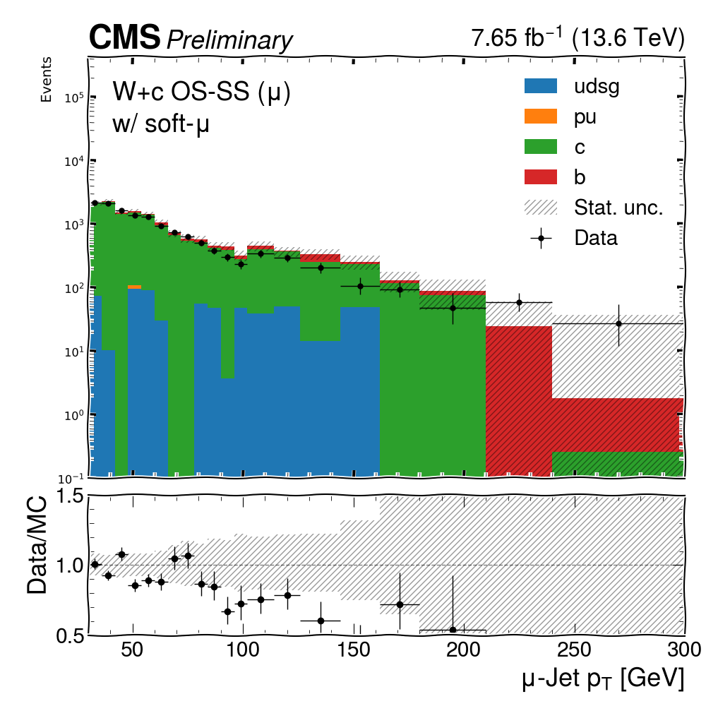
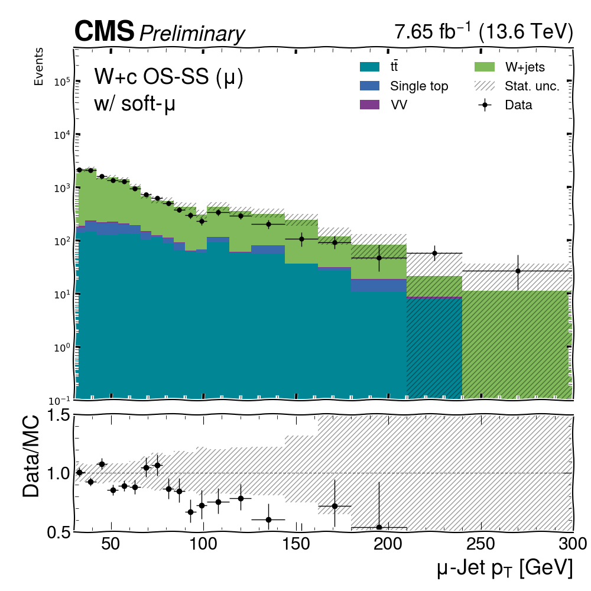
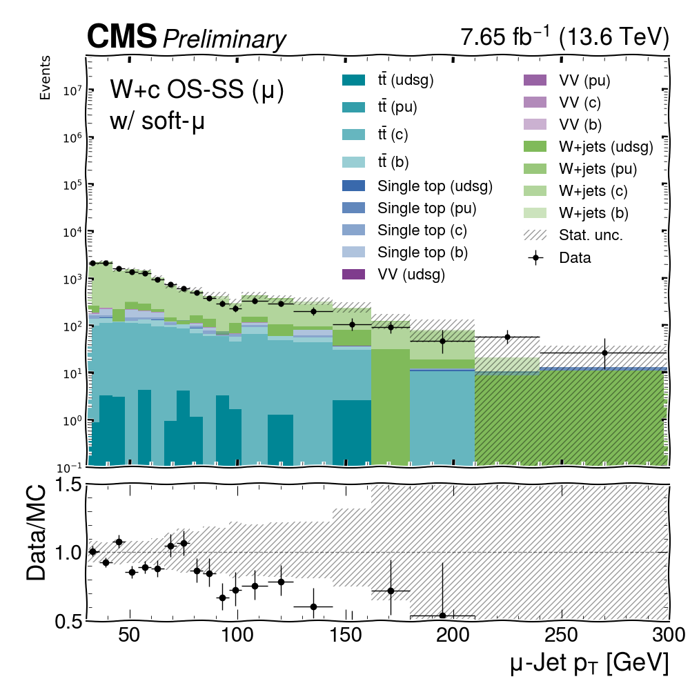
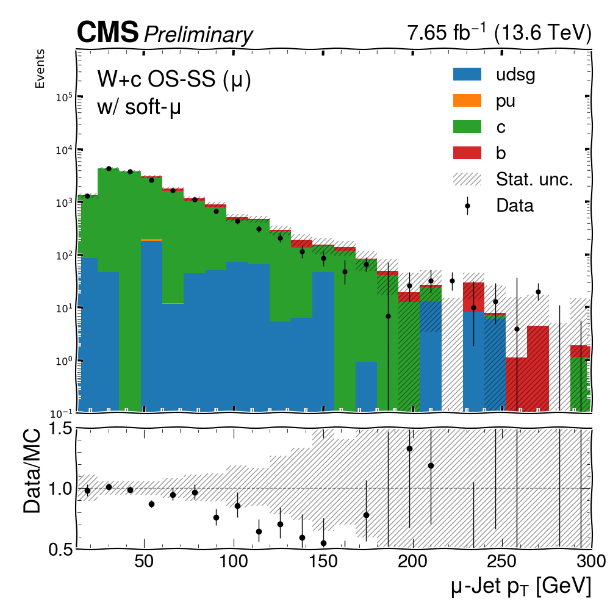

# Scripts for prepre input & process output

Here lists scripts can be used for BTV tasks


## `fetch.py` : create input json 


Use `fetch.py` in folder `scripts/` to obtain your samples json files. You can create `$input_list` ,which can be a list of datasets taken from CMS DAS or names of dataset(need to specify campaigns explicity), and create the json contains `dataset_name:[filelist]`. One can specify the local path in that input list for samples not published in CMS DAS.
`$output_json_name$` is the name of your output samples json file.

The `--whitelist_sites, --blacklist_sites` are considered for fetch dataset if multiple sites are available


 
## `dump_prescale.py`: Get Prescale weights

:::{caution}
Only works if `/cvmfs` is binding in the system
:::

Generate prescale weights using `brilcalc`

```bash
python scripts/dump_prescale.py --HLT $HLT --lumi $LUMIMASK
# HLT : put prescaled triggers
# lumi: golden lumi json
```


## Get processed information

Get the run & luminosity information for the processed events from the coffea output files. When you use `--skipbadfiles`, the submission will ignore files not accesible(or time out) by `xrootd`. This script helps you to dump the processed luminosity into a json file which can be calculated by `brilcalc` tool and provide a list of failed lumi sections by comparing the original json input to the one from the `.coffea` files.


```bash
# all is default, dump lumi and failed files, if run -t lumi only case. no json file need to be specified
python scripts/dump_processed.py -c $COFFEA_FILES -n $OUTPUT_NAME (-j $ORIGINAL_JSON -t [all,lumi,failed])
```

## `make_template.py`: Store histograms from coffea file

Use `scripts/make_template.py` to dump 1D/2D histogram from `.coffea` to `TH1D/TH2D` with hist. MC histograms can be reweighted to according to luminosity value given via `--lumi`. You can also merge several files 

```python
python scripts/make_template.py -i "testfile/*.coffea" --lumi 7650 -o test.root -v mujet_pt -a '{"flav":0,"osss":"sum"}'
```


```
  -i INPUT, --input INPUT
                        Input coffea file(s)
  -v VARIABLE, --variable VARIABLE
                        Variables to store (histogram name)
  -a AXIS, --axis AXIS  dict, put the slicing of histogram, specify 'sum' option as string
  --lumi LUMI           Luminosity in /pb
  -o OUTPUT, --output OUTPUT
                        output root file name
  --mergemap MERGEMAP   Specify mergemap as dict, '{merge1:[dataset1,dataset2]...}' Also works with the json file with dict
```


## Plotting code
### data/MC comparisons

Obtain the data MC comparisons from the input coffea files by normalized MC to corresponding luminosity.
You can specify `-v all` to plot all the variables in the `coffea` file, or use wildcard options (e.g. `-v "*DeepJet*"` for the input variables containing `DeepJet`). Individual variables can be also specify by splitting with `,`.

```bash
python scripts/plotdataMC.py -i $COFFEA --lumi $LUMI_IN_invPB -p $WORKFLOW -v $VARIABLE --autorebin $REBIN_OPTION --split $SPLIT_OPTION 
python scripts/plotdataMC.py -i a.coffea,b.coffea --lumi 41500 -p ttdilep_sf -v z_mass,z_pt  
python scripts/plotdataMC.py -i "test*.coffea" --lumi 41500 -p ttdilep_sf -v z_mass,z_pt # with wildcard option need ""
```

There are a few options supply for the splitting scheme based on jet flavor or sample. 

<div style="display: flex; justify-content: space-around; align-items: center;">
  <figure style="text-align: center;">
    
    <figcaption>Default: split by jet flavor</figcaption>
  </figure>

  <figure style="text-align: center;">
    
    <figcaption>--split sample: split by MC samples</figcaption>
  </figure>

  <figure style="text-align: center;">
    
    <figcaption>--split sample: split by MC samples</figcaption>
  </figure>

</div>

It also supports rebinning. Integer input refers the the rebinning through merging bins `--rebin 2`.  It also supports non-uniform rebinning, specify the bins with a list of edges `--autorebin 30,36,42,48,54,60,66,72,78,84,90,96,102,114,126,144,162,180,210,240,300`

<div style="display: flex; justify-content: space-around; align-items: center;">
  <figure style="text-align: center;">
    
    <figcaption>Default</figcaption>
  </figure>
  <figure style="text-align: center;">
    
    <figcaption>merge neighboring bins</figcaption>
  </figure>
  <figure style="text-align: center;">
    
    <figcaption>non-uniform rebin</figcaption>
  </figure>
</div>


```python

options:
  --lumi LUMI           luminosity in /pb
  --com COM             sqrt(s) in TeV
  -p {ttdilep_sf,ttsemilep_sf,ctag_Wc_sf,ctag_DY_sf,ctag_ttsemilep_sf,ctag_ttdilep_sf}, --phase {dilep_sf,ttsemilep_sf,ctag_Wc_sf,ctag_DY_sf,ctag_ttsemilep_sf,ctag_ttdilep_sf}
                        which phase space
  --log LOG             log on y axis
  --norm NORM           Use for reshape SF, scale to same yield as no SFs case
  -v VARIABLE, --variable VARIABLE
                        variables to plot, splitted by ,. Wildcard option * available as well. Specifying `all` will run through all variables.
  --SF                  make w/, w/o SF comparisons
  --ext EXT             prefix name
  -i INPUT, --input INPUT
                        input coffea files (str), splitted different files with ','. Wildcard option * available as well.
   --autorebin AUTOREBIN
                        Rebin the plotting variables, input `int` or `list`. int: merge N bins. list of number: rebin edges(non-uniform bin is possible)
   --xlabel XLABEL      rename the label for x-axis
   --ylabel YLABEL      rename the label for y-axis
   --splitOSSS SPLITOSSS 
                        Only for W+c phase space, split opposite sign(1) and same sign events(-1), if not specified, the combined OS-SS phase space is used
   --xrange XRANGE      custom x-range, --xrange xmin,xmax
   --flow FLOW 
                        str, optional {None, 'show', 'sum'} Whether plot the under/overflow bin. If 'show', add additional under/overflow bin. If 'sum', add the under/overflow bin content to first/last bin.
   --split {flavor,sample,sample_flav}
                        Decomposition of MC samples. Default is split to jet flavor(udsg, pu, c, b), possible to split by group of MC
                        samples. Combination of jetflavor+ sample split is also possible 
```


### data/data, MC/MC comparisons

You can specify `-v all` to plot all the variables in the `coffea` file, or use wildcard options (e.g. `-v "*DeepJet*"` for the input variables containing `DeepJet`)


```bash
# with merge map, compare ttbar with data
python scripts/comparison.py -i "*.coffea" --mergemap '{"ttbar": ["TTto2L2Nu_TuneCP5_13p6TeV_powheg-pythia8","TTto4Q_TuneCP5_13p6TeV_powheg-pythia8","TTtoLNu2Q_TuneCP5_13p6TeV_powheg-pythia8],"data":["MuonRun2022C-27Jun2023-v1","MuonRun2022D-27Jun2023-v1"]}' -r ttbar -c data -v mu_pt  -p ttdilep_sf
# if no  mergemap, take the key name directly
python scripts/comparison.py -i datac.coffea,datad.coffea -r MuonRun2022C-27Jun2023-v1 -c MuonRun2022D-27Jun2023-v1 -v mu_pt  -p ttdilep_sf

```


 ```
options:
  -h, --help            show this help message and exit
  -p {dilep_sf,ttsemilep_sf,ctag_Wc_sf,ctag_DY_sf,ctag_ttsemilep_sf,ctag_ttdilep_sf}, --phase {dilep_sf,ttsemilep_sf,ctag_Wc_sf,ctag_DY_sf,ctag_ttsemilep_sf,ctag_ttdilep_sf}
                        which phase space
  -i INPUT, --input INPUT
                        input coffea files (str), splitted different files with ','. Wildcard option * available as well.
  -r REF, --ref REF     referance dataset
  -c COMPARED, --compared COMPARED
                        compared datasets, splitted by ,
  --sepflav SEPFLAV     seperate flavour(b/c/light)
  --log                 log on y axis
  -v VARIABLE, --variable VARIABLE
                        variables to plot, splitted by ,. Wildcard option * available as well. Specifying `all` will run through all variables.
  --ext EXT             prefix name
  --com COM             sqrt(s) in TeV
  --mergemap MERGEMAP
                        Group list of sample(keys in coffea) as reference/compare set as dictionary format. Keys would be the new lables of the group
   --autorebin AUTOREBIN
                        Rebin the plotting variables, input `int` or `list`. int: merge N bins. list of number: rebin edges(non-uniform bin is possible)
   --xlabel XLABEL      rename the label for x-axis
   --ylabel YLABEL      rename the label for y-axis
   --norm               compare shape, normalized yield to reference
   --xrange XRANGE       custom x-range, --xrange xmin,xmax
   --flow FLOW 
                        str, optional {None, 'show', 'sum'} Whether plot the under/overflow bin. If 'show', add additional under/overflow bin. If 'sum', add the under/overflow bin content to first/last bin.
```


### ROCs & efficiency plots

Extract the ROCs for different tagger and efficiencies from validation workflow

```bash
python scripts/validation_plot.py -i  $INPUT_COFFEA -v $VERSION
```


```json
{
    "WJets": ["WJetsToLNu_TuneCP5_13p6TeV-madgraphMLM-pythia8"],
    "VV": [ "WW_TuneCP5_13p6TeV-pythia8", "WZ_TuneCP5_13p6TeV-pythia8", "ZZ_TuneCP5_13p6TeV-pythia8"],
    "TT": [ "TTTo2J1L1Nu_CP5_13p6TeV_powheg-pythia8", "TTTo2L2Nu_CP5_13p6TeV_powheg-pythia8"],
    "ST":[ "TBbarQ_t-channel_4FS_CP5_13p6TeV_powheg-madspin-pythia8", "TbarWplus_DR_AtLeastOneLepton_CP5_13p6TeV_powheg-pythia8", "TbarBQ_t-channel_4FS_CP5_13p6TeV_powheg-madspin-pythia8", "TWminus_DR_AtLeastOneLepton_CP5_13p6TeV_powheg-pythia8"],
"data":[ "Muon_Run2022C-PromptReco-v1", "SingleMuon_Run2022C-PromptReco-v1", "Muon_Run2022D-PromptReco-v1", "Muon_Run2022D-PromptReco-v2"]
}
```

### `correlation_plots.py` : get linear correlation from arrays

You can perform a study of linear correlations of b-tagging input variables. Additionally, soft muon variables may be added into the study by requesting `--SMu` argument. If you wan to limit the outputs only to DeepFlavB, PNetB and RobustParTAK4B, you can use the `--limit_outputs` option. If you want to use only the set of variables used for tagger training, not just all the input variables, then use the option `--limit_inputs`. To limit number of files read, make use of option `--max_files`. In case your study requires splitting samples by flavour, use `--flavour_split`. `--split_region_b` performs a sample splitting based on the DeepFlavB >/< 0.5. 

:::{caution}
For Data/MC comparison purpose pay attention - change ranking factors (xs/sumw) in L420! 
:::

```bash
python correlation_plots.py $input_folder [--max_files $nmax_files --SMu --limit_inputs --limit_outputs --specify_MC --flavour_split --split_region_b]
```


### `2Dhistogramms.py `: 2D plots (Correlation study-related)

To further investigate the correlations, one can create the 2D plots of the variables used in this study. Inputs and optional arguments are the same as for the correlation plots study.

```bash
python 2Dhistogramms.py $input_folder [--max_files $nmax_files --SMu --limit_inputs --limit_outputs --specify_MC --flavour_split --split_region_b]
```
