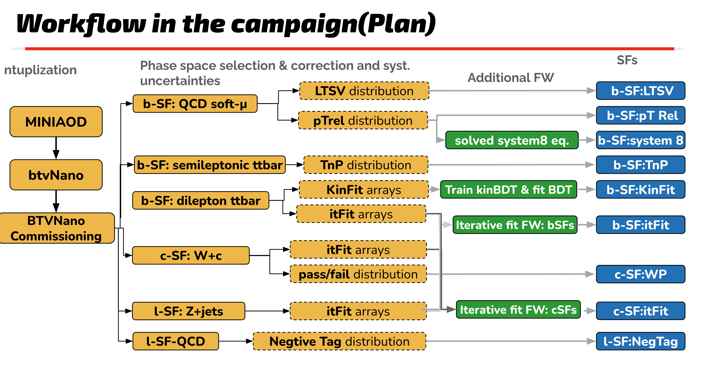

<!---
FIXME: We need to write down the selecitons for each phase space here
-->
## Selections for different phase spaces

The available workflows are summarized here, with dedicated selections.

The goal is to unified the selections among SFs team and commissioning workflows. 
Selections use for SFs also used in commissioning, the strucutre is summarized in the figure here



### Dileptonic $t\bar{t}$ phase space: b-tag SFs 

- `ttdilep_sf`:check performance for btag SFs, e$\mu$ selections

- `ctag_ttdilep_sf`, `ectag_ttdilep_sf`,`emctag_ttdilep_sf` : ttdilep selections with soft-muon

- `BTA_ttbar`: selections used in kinematic methods
### Semileptonic $t\bar{t}$ phase space: b-tag SFs/c-tag SFs
- `ttsemilep_sf`:  tt semileptonic selection, used in commissioning
- `c_ttsemilep_sf`: tag c jet on top of ttsemileptonic selections 
- `ctag_ttsemilep_sf`, `ectag_ttsemilep_sf`:  tt semileptonic  selections with soft-muon, same as W+c, higher jet multiplicty

### QCD muon enriched phase space: b-tag SFs 
- `QCD_smu_sf` : QCD selections with soft muon included, enriched b-jet

### W+c phase space : c-SFs
- `ctag_Wc_sf,ectag_Wc_sf`: check performance for charm SFs, c-jets enriched SFs, used in commissioning & iter-cSF
- `ctag_Wc_WP_sf,ectag_Wc_WP_sf`: WP base charm selections, used in commissioning & WP-cSF

### Z+jets phase space: light mis-tag rate
- `ctag_DY_sf, ectag_DY_sf`: Z+jets selections. Use in commissioning & iter-cSF

### QCD phase space: light mis-tag rate
- `QCD_sf`: select QCD events for light mis-tag rate. 


### BTA - BTagAnalyzer Ntuple producer (deprecated)

Based on Congqiao's [development](https://github.com/cms-btv-pog/BTVNanoCommissioning/blob/master/notebooks/BTA_array_producer.ipynb) to produce BTA ntuples based on PFNano.

:::{caution}
Only the newest version [BTV_Run3_2022_Comm_MINIAODv4](https://github.com/cms-btv-pog/btvnano-prod) ntuples work. Example files are given in [this](https://github.com/cms-btv-pog/BTVNanoCommissioning/blob/master/metadata/test_bta_run3.json) json. Optimize the chunksize(`--chunk`) in terms of the memory usage. This depends on sample, if the sample has huge jet collection/b-c hardons. The more info you store, the more memory you need. I would suggest to test with `iterative` to estimate the size.
:::


Run with the nominal `BTA` workflow to include the basic event variables, jet observables, and GEN-level quarks, hadrons, leptons, and V0 variables. 
```
python runner.py --wf BTA --json metadata/test_bta_run3.json --campaign Summer22EERun3 --isJERC
```

Run with the `BTA_addPFMuons` workflow to additionally include the `PFMuon` and `TrkInc` collection, used by the b-tag SF derivation with the QCD(μ) methods.
```
python runner.py --wf BTA_addPFMuons --json metadata/test_bta_run3.json --campaign Summer22EERun3 --isJERC
```

Run with the `BTA_addAllTracks` workflow to additionally include the `Tracks` collection, used by the JP variable calibration.
```
python runner.py --wf BTA_addAllTracks --json metadata/test_bta_run3.json --campaign Summer22EERun3 --isJERC
```

